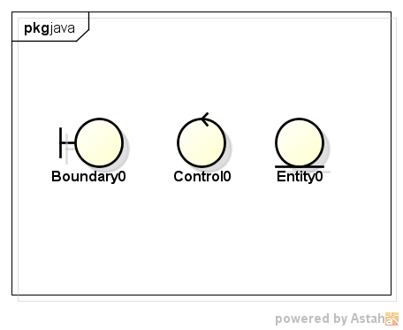

# Modelo Conceitual

- Artefato do domínio do problema e não do domínio da solução
- Não deve ser confundido com a arquitetura do software
- Não deve ser confundido com o modelo de dados

## Identificação de Conceitos

- Verificar o texto dos casos de uso (detalhados)
- Selecionar termos que representam informações sendo transmitidas "do" e "para" o sistema
- Agrupar sinônimos

## Adicionando Associações

A BUSCA POR ASSOCIAÇÕES ENTRE OS CONCEITOS SE BASEIA NOS REQUISITOS DE INFORMAÇÃO DOS CASOS DE USO CORRENTEMENTE **EM DESENVOLVIMENTO**

UMA ASSOCIAÇÃO É UM RELACIONAMENTO ENTRE CONCEITOS QUE INDICA UMA CONEXÃO COM **SIGNIFICADO E INTERESSE**

Associações úteis são aquelas para as quais há **necessidade de conhecimento** do relacionamento

A associação tem a notação de uma linha ligando os conceitos, podendo conter um **nome** e uma **cardinalidade**

## Estereótipos para Classes



> Boundary = fronteira

> Control = Controle

> Entity = Entidade

## Associações

- Associação: relação estática que pode existir entre dois conceitos complexos, complementando a informação que se tem sobre eles em um determinado instante, ou referenciando informação associativa nova

- Operação: ato de transformar a informação, passando de um estado para outro, mudando, por exemplo, a configuração das associações, destruindo e/ou criando novas associações ou objetos, ou modificando o valor dos atributos

## Nomeando uma Associação

```bash
[Conceito 1]    ehPropriedadeDe    [Conceito 2]
[          ]_______________________[          ]
```

- Uma operação (transação) não deve ser modelada como associação

```bash
[ Cliente ]         compra        [ Automovel ]
[         ]_______________________[           ]
```
